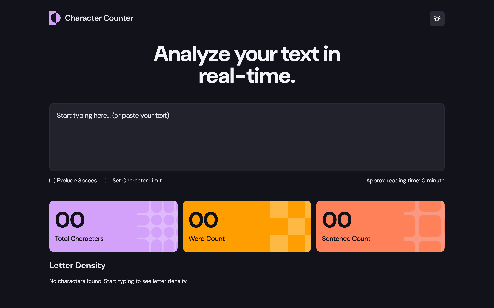

# Frontend Mentor - Character counter solution

This is a solution to the [Character counter challenge on Frontend Mentor](https://www.frontendmentor.io/challenges/character-counter-znSgeWs_i6). 

## Table of contents

- [Overview](#overview)
  - [The challenge](#the-challenge)
  - [Screenshot](#screenshot)
  - [Links](#links)
- [My process](#my-process)
  - [Built with](#built-with)
  - [What I learned](#what-i-learned)
  - [Continued development](#continued-development)
  - [Useful resources](#useful-resources)
- [Author](#author)
- [Acknowledgments](#acknowledgments)

## Overview

### The challenge

Users should be able to:

- Analyze the character, word, and sentence counts for their text
- Exclude/Include spaces in their character count
- Set a character limit
- Receive a warning message if their text exceeds their character limit
- See the approximate reading time of their text
- Analyze the letter density of their text
- Select their color theme
- View the optimal layout for the interface depending on their device's screen size
- See hover and focus states for all interactive elements on the page

### Screenshot

### Links

- Live Site URL: (https://character-counter-rose.vercel.app/)

## My process

### Built with

- Semantic HTML5 markup
- CSS custom properties
- Flexbox
- Vanilla JavaScript

### What I learned

Through this project, I learned how to:

1. Create a responsive layout that works well on desktop, tablet, and mobile devices
2. Implement a modern dark/light theme switcher
3. Build interactive features like expandable sections and real-time text analysis
4. Calculate and display text statistics including:
   - Character count with/without spaces
   - Word and sentence counting
   - Reading time estimation
   - Letter frequency analysis with percentage bars
5. Write clean, maintainable CSS using variables and a consistent spacing system
6. Handle various UI states and user interactions without relying on frameworks
7. Create smooth animations and transitions for a better user experience

### Continued development

Moving forward, I want to improve in these areas:

- Making websites more accessible for all users
- Writing better JavaScript code for handling large amounts of text
- Adding proper testing to ensure everything works correctly
- Making the interface faster and smoother to use

### Useful resources

- [MDN String Methods](https://developer.mozilla.org/en-US/docs/Web/JavaScript/Reference/Global_Objects/String) - This was super helpful for understanding different ways to manipulate text in JavaScript. The examples really helped me grasp concepts like string splitting and character counting.

## Author

- Website - [Shakirat Akanji](https://shakeerah.framer.website/)
- Frontend Mentor - [@Anikhe00](https://www.frontendmentor.io/profile/Anikhe00)
- Twitter - [@i_am_anikhe](https://x.com/I_am_anikhe)

## Acknowledgments

Special thanks to:

- The Frontend Mentor community for their valuable feedback and suggestions
- MDN Web Docs for their comprehensive JavaScript documentation
- My fellow developers who helped test the application across different devices